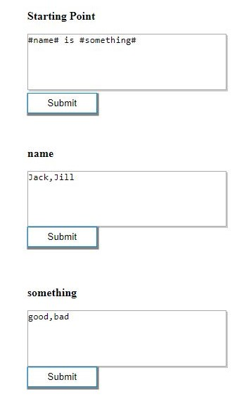
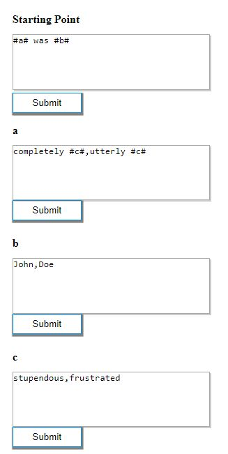

# RANDOM-TEXT-GENERATOR BASED ON CONTEXT-FREE-GRAMMAR
> In collaration with <a href="https://github.com/Damiki">Damiki</a>
## CHECK THE APP <a href="https://rtgenerator.herokuapp.com/">HERE</a>
### Running the Project Locally
Ensure you have NodeJS installed and run the following commands in the terminal:
### `npm install`
### `npm start`
      
## Example 1: Basic Starting Point Grammar Rules
### Inputs

  

After clicking on "GENERATE!", you will get one random output out of the 4 possible outputs:
#### Jack is good
#### Jack is bad
#### Jill is good
#### Jill is bad

###  Example 2: To demonstrate Grammar Rules within Grammar Rules
### Inputs

The generated outputs can be:

### Completely frustrated was John
### Utterly stupendous was Doe
#### You get the picture.

## NOW ENJOY & GO CRAZY WITH YOUR GRAMMAR RULES!
