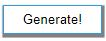

## RANDOM-TEXT-GENERATOR BASED ON CONTEXT-FREE-GRAMMAR
### Running the Project
Ensure you have NodeJS installed and run the following commands in the terminal:
### `npm install`
### `npm start`

## EXAMPLES
### Inputs

### Generate

You will get one random output out of the 4 possible outputs:
### Jack is good
### Jack is bad
### Jill is good
### Jill is bad

## ENJOY! GO CRAZY WITH YOUR GRAMMAR RULES!
